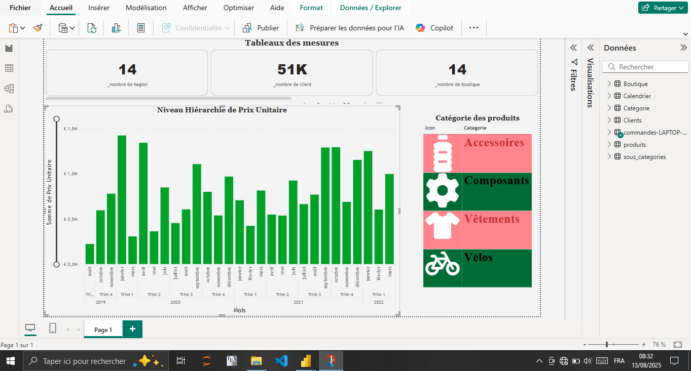

<table>
  <tr>
    <td width="220" valign="top">
      
    </td>
    <td valign="top" style="padding-left:20px;">
      <h2>AHMED SEFDINE</h2>
      
<strong>Ingénieur Statisticien • Data Analyst • BI</strong>

      

        📠Liberté 6, Dakar, Sénégal 
        📠+221 77 808 09 42 
        ✉️ <a href="mailto:ahmed.sefdine@uadb.edu.sn">ahmed.sefdine@uadb.edu.sn</a> 
        📄 <a href="cv/CV-AHMED-SEFDINE.pdf" target="_blank">Télécharger le CV</a>
      

      

        🌐 <a href="https://github.com/sefdineahmed" target="_blank">GitHub</a> ·
        <a href="https://www.linkedin.com/in/sefdineahmed/" target="_blank">LinkedIn</a> ·
        <a href="https://shahidi-ai.streamlit.app/" target="_blank">App Streamlit</a>
      

    </td>
  </tr>
</table>

---

## Profil
Passionné par l’analyse de données, je combine rigueur et curiosité intellectuelle pour transformer des données brutes en **insights stratégiques** facilitant la prise de décision. Intérêt marqué pour l’apprentissage automatique et les méthodes statistiques avancées, avec une expérience appliquée en santé publique et en statistique nationale.

---

## 🔎 Compétences clés

- **Langages & Data Science** : Python, R  
- **Bases de données & ETL** : PostgreSQL, MySQL, SQL, Talend Open Studio  
- **Visualisation & BI** : Power BI, Tableau  
- **Statistiques & Outils** : IBM SPSS, méthodes de survie (Kaplan-Meier, Cox), modèles de survie ML  
- **Collecte de données** : KoboToolbox/ODK, CSPro, Sphinx, Google Forms  
- **Rédaction scientifique & bureautique** : LaTeX, Microsoft Office (Excel avancé, Word, PowerPoint)  

---

## 🎓 Formation

**Master II — Statistique et informatique décisionnelle**  
Université Alioune Diop — Bambey, Sénégal | 2022 – 2025

**Licence Pro — Mathématiques, Statistique & Informatique Décisionnelle**  
Université des Comores — Moroni, Comores | 2019 – 2020

**DUT — Statistique**  
Université des Comores — Moroni, Comores | 2017 – 2019

**Baccalauréat Scientifique (TD)**  
École Privée Communautaire Franco Arabe de Dimani — Ntsoralé, Comores | 2016 – 2017

---

## 💼 Expérience professionnelle

**Stagiaire — Hôpital Aristide Le Dantec (HALD)**  
_Déc. 2024 – Avr. 2025, Dakar, Sénégal_  
- Analyse de survie pour le cancer de l'estomac (Kaplan-Meier, Cox).  
- Mise en œuvre et comparaison de modèles de survie basés sur le machine learning (Random Survival Forest, GBST, Deep Survival Models).  
- Déploiement du modèle retenu pour l’aide à la décision médicale.

**Stagiaire — Institut National de Statistique des Études Économiques et Démographiques**  
_Mai 2021 – Déc. 2021, Moroni, Comores_  
- Collecte, traitement et analyse des données relatives aux indices des prix.  
- Rédaction de rapports trimestriels et participation à l’amélioration des méthodologies.

**Stagiaire — Agence Nationale de l’Aviation Civile et de la Météorologie**  
_Juil. 2019 – Sept. 2019, Moroni, Comores_  
- Analyse descriptive du trafic aérien (2005–2017).  

---

## 🏆 Certifications
- **Certificat en Data Engineering**, Université numérique Cheikh Hamidou KANE (UNCHK) — Juil. 2024  
- **Certificat Low Code / No Code**, UNCHK — Déc. 2023

---

## 🌐 Langues
- Français — Courant  
- Anglais — Intermédiaire / professionnel

---

## 📇 Références
- **Pr. Aba DIOP** — Enseignant-chercheur, Université Alioune Diop de Bambey  
  `aba.diop@uadb.edu.sn` · `+221 77 443 36 66`

- **Gaoussou CAMARA** — Professeur assimilé, Université Alioune Diop de Bambey  
  `gaoussou.camara@uadb.edu.sn` · `+221 77 570 88 07`

---
# 📊 Dashboards interactifs

> Cliquez sur une image pour la visualiser, ou sur le bouton **Télécharger** pour obtenir le fichier `.pbix`.

<table align="center">
  <tr>
    <td align="center">
      
       
      <a href="dashboard/supermark.pbix" download>⬇️ Télécharger — supermark</a>
    </td>
    <td align="center">
      
       
      <a href="dashboard/Netflix analyst.pbix" download>⬇️ Télécharger — Ventes</a>
    </td>
  </tr>
  <tr>
    <td align="center">
      
       
      <a href="dashboard/Sales_Dashboard.pbix" download>⬇️ Télécharger — Ventes</a>
    </td>
    <td align="center">
      
       
      <a href="dashboard/Sales_Dashboard.pbix" download>⬇️ Télécharger — Netflix</a>
    </td>
  </tr>
</table>

---

## 🎯 Centres d'intérêt
- Veille technologique & actualités  
- E-learning  
- Sport et bien-être

---
